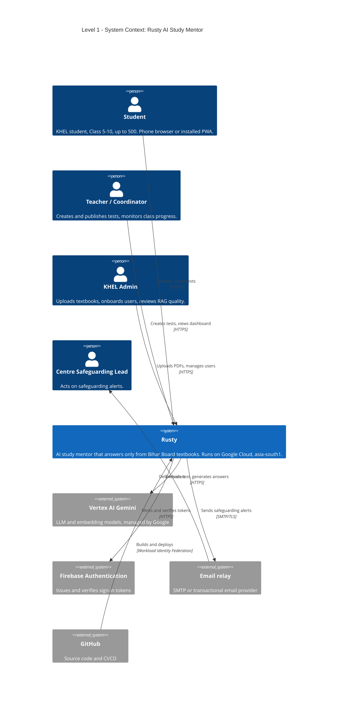
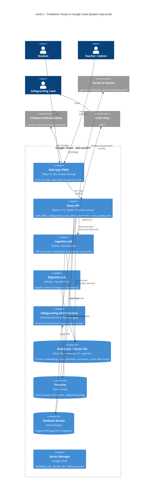
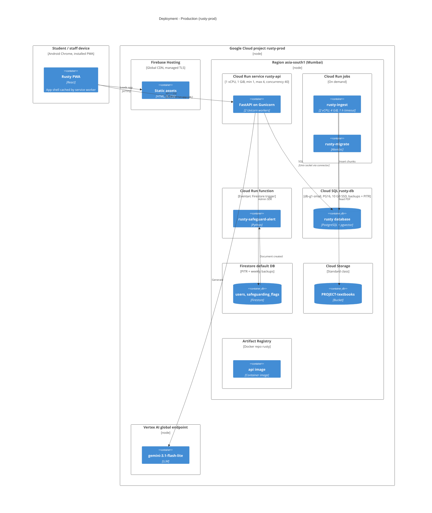
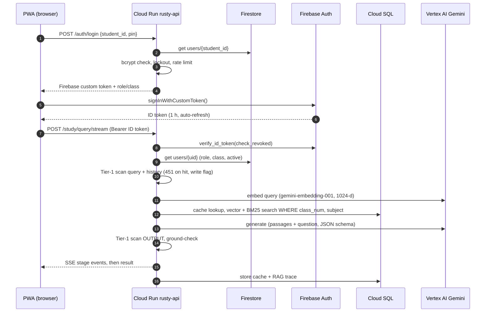

# Rusty — GCP Deployment Plan

> **Audience:** the KHEL / Rusty team, assumed new to Google Cloud.
> **Scope:** production hosting for up to **500 students** (plus teachers and admins), optimised for low cost and low operational effort.
> **Status:** plan only. Nothing has been provisioned. §7 lists code changes that must land before the first deploy.
> **Prepared:** 2026-09-29. Prices and model availability were checked against Google's public pages on this date (see §13). Re-check them before provisioning.

---

## Contents

1. [Summary & key decisions](#1-summary--key-decisions)
2. [Requirements & sizing](#2-requirements--sizing)
3. [Architecture overview](#3-architecture-overview)
4. [C4 diagrams](#4-c4-diagrams)
5. [Component design](#5-component-design)
6. [Cost estimate](#6-cost-estimate)
7. [Code changes required before deploy](#7-code-changes-required-before-deploy)
8. [Step-by-step setup runbook](#8-step-by-step-setup-runbook)
9. [CI/CD pipeline](#9-cicd-pipeline)
10. [Operations runbooks](#10-operations-runbooks)
11. [Security & compliance checklist](#11-security--compliance-checklist)
12. [GCP glossary for newcomers](#12-gcp-glossary-for-newcomers)
13. [Sources](#13-sources)

---

## 1. Summary & key decisions

**The whole stack is serverless and managed. There are no VMs, no Kubernetes and no load balancer.** You pay mostly for what students use. The only always-on costs are one small database and one warm API instance.

| # | Decision | Choice | Why |
|---|---|---|---|
| D1 | Region | **`asia-south1` (Mumbai)** for everything that stores data | Closest region to Bihar with the full service set. Keeps student data in India. |
| D2 | Backend compute | **Cloud Run** service (FastAPI container) | Scales to demand and is billed per request. The Dockerfile already targets it (non-root, port 8080). |
| D3 | Frontend hosting | **Firebase Hosting** | Free tier covers this app, with global CDN, free SSL and optional custom domain. Already in the Firebase ecosystem the app uses. |
| D4 | Database | **Cloud SQL for PostgreSQL 16 + pgvector**, `db-g1-small` | Managed backups and patching. pgvector is supported. Smallest tier that fits 500 users. |
| D5 | Users & safeguarding flags | **Firestore (Native) + Firebase Authentication** | Already what the code uses. Effectively free at this scale. |
| D6 | PDF ingestion | **Cloud Run Job**, triggered by the API | FastAPI `BackgroundTasks` are unreliable on Cloud Run (CPU is throttled after the response is sent). |
| D7 | LLM | **`gemini-3.1-flash-lite` via the Vertex AI `global` endpoint** (recommended) | Cheapest current GA Gemini, retiring no earlier than May 2027. **Trade-off:** processing may happen outside India. See §5.7. |
| D8 | Embeddings | **`gemini-embedding-001` at 1024 dimensions** | Multilingual (Hindi) and fits the existing `vector(1024)` column. The configured `text-multilingual-embedding-002` maxes out at 768 dimensions and **will fail** with the current config. |
| D9 | Networking | **No VPC, no load balancer.** Cloud Run public URL + built-in Cloud SQL connector | Saves about $20+/month and a lot of complexity. The DB has no public access path (IAM-authenticated connector only). |
| D10 | Environments | **2 GCP projects:** `rusty-staging` and `rusty-prod` | Isolation for testing. Staging scales to zero and costs about $10–15/month. |
| D11 | CI/CD | **GitHub Actions + Workload Identity Federation** | No service-account key files (a CLAUDE.md rule). Extends the existing `ci.yml`. |

**Expected monthly cost (production):**

| Scenario | Estimated cost |
|---|---|
| Typical | **~$110 (≈ ₹9,700)** |
| Light | ~$80 |
| Heavy | ~$205 |
| Staging | ~$10–15 extra |

The LLM is the only cost that grows with usage. See §6.

> ⚠️ **Time-sensitive:** the code's default model `gemini-2.5-flash-lite` is **retired on 2026-10-20**. The code also uses `vertexai.generative_models`, which Google **removed from the Vertex AI SDK in June 2026**. Both must be fixed before any production use (§7, item B2).

---

## 2. Requirements & sizing

### 2.1 Functional requirements
Everything described in [PROJECT_ANALYSIS.md](PROJECT_ANALYSIS.md) §4:
- Study Q&A with Server-Sent Events (SSE) streaming.
- Practice tests and published tests.
- PDF ingestion with chapter summaries.
- Teacher and admin dashboards.
- Safeguarding scans and alerts.

### 2.2 Load assumptions

| Metric | Assumption |
|---|---|
| Registered students | 500 (hard ceiling for this plan) |
| Teachers / admins | ~20–30 |
| Daily active students | 20–40% (100–200) |
| Study questions per active student per day | 5–10 |
| Practice tests per active student per day | 0.5–1 |
| Peak concurrent users | ~150 (a full centre session) |
| Peak in-flight requests | ~20–30 (LLM calls take 3–8 s each) |
| Textbooks | ~20–40 PDFs (Classes 5–10 × 5 subjects) → ~20–60k chunks |
| Vector data size | ~60k × 1024 floats × 4 bytes ≈ **250 MB**, which fits comfortably on the smallest DB |

### 2.3 Non-functional requirements (from CLAUDE.md)
- Closed access only; child safeguarding cannot be bypassed.
- No real names, ages or contact details anywhere. **No IP addresses and no unmasked student IDs in logs.**
- No conversation history stored server-side.
- Secrets only in Secret Manager. No credential files in git.
- No CORS wildcard in production. The container must not run as root.

### 2.4 Availability target
- Pilot target is **~99.5%** during school hours.
- Zonal (single-zone) database with daily backups and point-in-time recovery.
- Recovery Point Objective (RPO, the most data you could lose) is **≤ 5 minutes** thanks to point-in-time recovery.
- Recovery Time Objective (RTO, the time to restore service) is **≤ 1 hour**.
- High availability (a standby database) would double the DB cost and is not justified at this scale. §10.8 lists when to add it.

---

## 3. Architecture overview

```
                 ┌──────────────────────── Google Cloud project: rusty-prod ────────────────────────┐
 Student phone   │                                                                                  │
 (PWA) ──HTTPS──►│  Firebase Hosting (global CDN)  ── static React build only                       │
      │          │                                                                                  │
      │          │  ┌──────────────── Region asia-south1 (Mumbai) ────────────────────────────────┐ │
      └─HTTPS───►│  │ Cloud Run service  rusty-api  (FastAPI, min 1 / max 4 instances)            │ │
  Bearer ID token│  │    │  │  │  │                                                               │ │
                 │  │    │  │  │  └──► Cloud Run job rusty-ingest ──► Cloud Storage (PDFs)         │ │
                 │  │    │  │  └─────► Firestore (users, safeguarding_flags) ──Eventarc──►          │ │
                 │  │    │  │                          Cloud Run function rusty-safeguard-alert ─► Email
                 │  │    │  └────────► Cloud SQL PostgreSQL 16 + pgvector (rusty-db)                │ │
                 │  │    └───────────► Secret Manager (DB URL, SECRET_KEY)                         │ │
                 │  └──────┼─────────────────────────────────────────────────────────────────────┘ │
                 │         └────────► Vertex AI Gemini (global endpoint) + gemini-embedding-001     │
                 │  Firebase Authentication (custom token → ID token)                               │
                 └──────────────────────────────────────────────────────────────────────────────────┘
        GitHub Actions ──(Workload Identity Federation)──► Artifact Registry → Cloud Run / Firebase Hosting
```

### Why not the alternatives?

| Alternative | Rejected because |
|---|---|
| GKE (Kubernetes) | Cluster management fee plus heavy operational burden. Overkill for one service. |
| Compute Engine VM with Docker Compose | Cheaper on paper (~$15/month), but you'd own OS patching, TLS, backups and uptime. Risky for a team new to GCP. |
| App Engine | Legacy direction; Cloud Run is Google's recommended path. |
| External HTTPS Load Balancer + Cloud Armor | About $18–25/month minimum. Only worth it with a custom API domain, a WAF, or multi-region. Revisit later (§10.8). |
| Self-hosted Ollama on GPU | A GPU instance costs hundreds of dollars a month. Qwen 3B on CPU Cloud Run is too slow for SSE UX. |
| AlloyDB / Vertex Vector Search | Each costs 5–10× Cloud SQL. pgvector handles 60k vectors easily. |
| Firebase Hosting rewrite for `/api/**` → Cloud Run | Hosting-to-Cloud Run rewrites have a 60 s timeout and are not a good fit for SSE streaming. Call the Cloud Run URL directly instead. |

---

## 4. C4 diagrams

> The diagrams use Mermaid C4 syntax and were render-checked with mermaid-cli 11. They render on GitHub; in VS Code, install the "Markdown Preview Mermaid Support" extension. Mermaid's C4 layout is automatic, so some arrow labels overlap. The runtime secret injection and the ingest-job-to-Gemini call are described in §5 rather than drawn.

### 4.1 Level 1 — System context



### 4.2 Level 2 — Containers



### 4.3 Deployment (production)



### 4.4 Key flow — login and a study question



---

## 5. Component design

### 5.1 Projects, region and naming

| Item | Staging | Production |
|---|---|---|
| Project ID (example; must be globally unique) | `rusty-staging-khel` | `rusty-prod-khel` |
| Region | `asia-south1` | `asia-south1` |
| Firebase Hosting site | `rusty-staging-khel.web.app` | `rusty-prod-khel.web.app` (+ optional custom domain) |
| Cloud Run service | `rusty-api` | `rusty-api` |
| Cloud SQL instance | `rusty-db` (`db-f1-micro`) | `rusty-db` (`db-g1-small`) |
| Git branch | `staging` | `main` (manual approval) |

**Delhi (`asia-south2`) is geographically closer, but it lacks some services used here.** Mumbai adds only ~20 ms of latency and is in Cloud Run's cheaper Tier 1 pricing.

### 5.2 Cloud Run service `rusty-api`

| Setting | Value | Reason |
|---|---|---|
| CPU / memory | 1 vCPU / 1 GiB | 2 Gunicorn workers each load the Firebase and GenAI SDKs (~300–400 MB each). |
| Billing | Request-based (default) | Cheapest. CPU is allocated only while serving requests. |
| Min instances | **1** | Avoids 5–15 s cold starts for students. Costs ~$13/month idle. Can set 0 at night (§6.3). |
| Max instances | **4** | Caps cost and DB connections. 4 × 40 = 160 concurrent requests, which is ample. |
| Concurrency | 40 | Async app, but LLM-bound. Keeps per-instance latency predictable. |
| Request timeout | 120 s | SSE answers finish in <30 s. Ingestion is no longer done in-request. |
| Startup CPU boost | On | Faster cold starts at no extra cost. |
| Ingress | All | The browser calls it directly. |
| Authentication | `--allow-unauthenticated` | The app enforces its own Firebase auth on every route. IAM auth would block browsers. |
| Service account | `rusty-api@…` | Least privilege (§5.10). |
| Cloud SQL | `--add-cloudsql-instances` | Built-in connector, Unix socket, no VPC needed. |
| Secrets | `DATABASE_URL`, `SECRET_KEY` from Secret Manager | Never stored in the image or in env files. |

**Runtime environment variables (production):**

| Variable | Value | Notes |
|---|---|---|
| `APP_ENV` | `production` | **Critical:** any other value enables dev tokens (`dev-admin-token`). |
| `LLM_PROVIDER` | `vertex` | |
| `VERTEX_AI_PROJECT` | *project id* | |
| `VERTEX_AI_LOCATION` | `global` | Option A. Use `asia-south1` for Option B (§5.7). |
| `GEMINI_MODEL` | `gemini-3.1-flash-lite` | `gemini-3.5-flash` for Option B. |
| `VERTEX_EMBED_MODEL` | `gemini-embedding-001` | |
| `EMBED_DIM` | `1024` | Must match `vector(1024)`. |
| `FIREBASE_PROJECT_ID` | *project id* | |
| `FIREBASE_AUTH_EMULATOR_HOST`, `FIRESTORE_EMULATOR_HOST` | **unset** | Setting either would point production at an emulator. |
| `ALLOWED_ORIGINS` | `https://<project>.web.app,https://<project>.firebaseapp.com[,https://custom.domain]` | No wildcard. |
| `SAFEGUARDING_ALERT_EMAIL` | safeguarding lead's address | |
| `PHRASES_FILE_PATH` | `./safeguarding/phrases_v1.json` | Baked into the image. |
| `DB_POOL_SIZE` / `DB_MAX_OVERFLOW` *(new)* | `3` / `2` | See §5.4 connection budget. |
| `TEXTBOOK_BUCKET` / `INGEST_JOB_NAME` *(new)* | `<project>-textbooks` / `rusty-ingest` | For the ingestion job flow. |

### 5.3 Cloud Run jobs

| Job | Command | Resources | Trigger |
|---|---|---|---|
| `rusty-migrate` | `alembic upgrade head` | 1 vCPU / 512 MiB, 10 min | Every deploy, **before** the new API revision gets traffic |
| `rusty-ingest` | `python -m rag.ingestion.job --source-pdf … --gcs-uri …` *(to be written)* | 2 vCPU / 4 GiB, 60 min, 1 retry | API `POST /admin/upload-pdf`: saves the PDF to GCS, then calls the Run Admin API with argument overrides |

The jobs use the **same container image** as the API, so there's only one build.

### 5.4 Cloud SQL (PostgreSQL 16 + pgvector)

| Setting | Production | Staging |
|---|---|---|
| Edition / tier | Enterprise, **`db-g1-small`** (shared vCPU, 1.7 GB RAM) | `db-f1-micro` (0.6 GB) |
| Storage | 10 GB SSD, auto-increase on | 10 GB SSD |
| Availability | Zonal (no standby) | Zonal |
| Backups | Daily at 02:00 IST, keep 7 | Daily, keep 3 |
| Point-in-time recovery | **On** (7 days of logs) | Off |
| Deletion protection | On | On |
| Public access | Public IP with **no authorised networks**; access only via the IAM-authenticated Cloud SQL connector | Same |
| Extensions | `vector`, `pg_trgm`, `uuid-ossp` (created by migration) | Same |

**Connection budget:** `db-g1-small` allows about **50** connections.
- Current code: `pool_size=10`, `max_overflow=20` per worker, which is 2 workers × 30 × 4 instances = **240 connections**. That will exhaust the database.
- With `DB_POOL_SIZE=3`, `DB_MAX_OVERFLOW=2`: 2 workers × 5 × 4 instances = **40**, leaving ~10 for jobs and admin use.

**Upgrade trigger:** CPU above 70% sustained, or a need for an SLA. Then move to `db-custom-1-3840` (dedicated vCPU, ~$50–60/month, SLA-covered). Shared-core tiers are **not covered by the Cloud SQL SLA**, which is an accepted pilot trade-off.

`DATABASE_URL` format (Unix socket):
```
postgresql+asyncpg://rusty_app:<password>@/rusty?host=/cloudsql/<PROJECT_ID>:asia-south1:rusty-db
```

### 5.5 Firestore and Firebase Authentication

**Firestore (Native mode):**
- Settings: location `asia-south1`, delete protection on, point-in-time recovery on, weekly backups kept for 14 weeks. The backups protect `safeguarding_flags`, which must never be deleted.
- **Security rules deny all client access.** Only the backend (Admin SDK) touches Firestore:
  ```
  rules_version = '2';
  service cloud.firestore {
    match /databases/{database}/documents {
      match /{document=**} { allow read, write: if false; }
    }
  }
  ```

**Firebase Authentication:**
- Sign-in method: **no providers enabled.** Rusty only uses custom tokens minted by the backend, and disabling providers prevents self-registration.
- Authorised domains: the Hosting domains only.
- Web API key: restrict it to the Identity Toolkit and Token Service APIs and to your Hosting domains as HTTP referrers.
- Firebase Auth keeps its records in Google's global infrastructure. It stores only the pseudonymous student ID (for example `KHEL-2026-001`), never names.

**Service-account gotcha:** on Cloud Run, `create_custom_token()` signs through the IAM API. The runtime service account therefore needs **Service Account Token Creator on itself**, or login fails with a signing error.

### 5.6 Firebase Hosting (frontend)

- Build: `npm run build` with `VITE_API_URL=https://<cloud-run-url>` and the `VITE_FIREBASE_*` web config.
- Add a `hosting` block to the existing `firebase.json`, keeping the emulator block:

```json
"hosting": {
  "public": "frontend/dist",
  "ignore": ["**/.*"],
  "rewrites": [{ "source": "**", "destination": "/index.html" }],
  "headers": [
    { "source": "/**", "headers": [
      { "key": "Content-Security-Policy", "value": "default-src 'self'; script-src 'self'; style-src 'self' 'unsafe-inline' https://cdn.jsdelivr.net; font-src 'self' data: https://cdn.jsdelivr.net; img-src 'self' data:; connect-src 'self' https://<cloud-run-host> https://identitytoolkit.googleapis.com https://securetoken.googleapis.com; worker-src 'self'; frame-ancestors 'none'" },
      { "key": "X-Content-Type-Options", "value": "nosniff" },
      { "key": "Referrer-Policy", "value": "strict-origin-when-cross-origin" },
      { "key": "Permissions-Policy", "value": "geolocation=(), camera=(), microphone=()" }
    ]},
    { "source": "/assets/**", "headers": [{ "key": "Cache-Control", "value": "public, max-age=31536000, immutable" }]},
    { "source": "**/@(index.html|sw.js|manifest.webmanifest)", "headers": [{ "key": "Cache-Control", "value": "no-cache" }]}
  ]
}
```
Once KaTeX CSS is bundled locally, remove `cdn.jsdelivr.net` from the CSP.

**Custom domain (optional, free):** something like `rusty.khelfoundation.org`. Add it in Firebase console → Hosting → *Add custom domain*, then create the DNS records it shows. The API stays on its `*.run.app` URL, which avoids a load balancer.

### 5.7 Vertex AI — models and data residency ⚖️ *decision for KHEL*

Findings from Google's model pages as of 2026-09-29:

| Model | Status | Processing in Mumbai? | Price per 1M tokens (in / out) |
|---|---|---|---|
| `gemini-2.5-flash-lite` (current default) | **Retires 2026-10-20** | No | — |
| `gemini-3.1-flash-lite` | GA, retires ≥ May 2027 | **No** (global / US / EU) | **$0.25 / $1.50** (global) |
| `gemini-3.5-flash-lite` | GA, retires ≥ Jul 2027 | No (global / US / EU) | $0.30 / $2.50 |
| `gemini-3.5-flash` | GA, retires ≥ May 2027 | **Yes (`asia-south1`)** | $1.65 / $9.90 (regional) |
| `gemini-embedding-001` | GA | Verify in console | $0.15 (per 1M tokens) |

**Option A (recommended for cost):** `gemini-3.1-flash-lite` on the `global` endpoint.
- Google states the global endpoint gives no control over which region does the processing.
- **What leaves India per request:** the question text, up to 10 prior turns, and textbook passages. No student ID, name or IP is sent.
- Tier-1 safeguarding blocks disclosure-type messages before they reach the model.
- LLM cost is **~$60/month** for typical usage.

**Option B (strict in-country processing):** `gemini-3.5-flash` in `asia-south1`.
- It's a stronger model, but costs **~6–7× more**: ~$380/month typical, up to ~$1,000 heavy.
- Switching needs only two environment variables: `VERTEX_AI_LOCATION` and `GEMINI_MODEL`.

> **Action for KHEL leadership (not legal advice):** confirm with your legal or data-protection adviser whether sending pseudonymous study questions from minors outside India is acceptable under your DPDP Act 2023 obligations and parental-consent terms. If unsure, launch on Option B for the pilot and move to A later.

**Model settings in either option:**
- Use the **lowest thinking level** the model supports. Thinking tokens are billed as output.
- Use `temperature` 0.1–0.2 and JSON `response_schema`.
- Consider Vertex AI's **zero-data-retention** settings: disable prompt caching and request the abuse-monitoring logging exception. This matches "never store conversation history server-side".
- Before switching production, run the existing eval harness (`backend/eval/run_eval.py`) against staging. It should pass at least 10/11 and include Hindi cases.

**Embedding model:** use `gemini-embedding-001` with `output_dimensionality=1024`. Use `task_type=RETRIEVAL_DOCUMENT` for chunks and `RETRIEVAL_QUERY` for questions. Ingestion and queries **must use the same model**, so all PDFs are re-ingested on first deploy.

### 5.8 Cloud Storage
- Bucket: `<project>-textbooks`, in `asia-south1`, Standard class.
- Uniform bucket-level access, public access prevention on, default soft delete (7 days).
- Original PDFs are **kept**, because changing the embedding model requires re-ingesting everything (a CLAUDE.md note). About 1–2 GB total, costing pennies.

### 5.9 Secret Manager

| Secret | Used by |
|---|---|
| `DATABASE_URL` | API, migrate job, ingest job |
| `SECRET_KEY` | API |
| `SMTP_PASSWORD` (or email API key) | Safeguarding alert function |

Rotation: add a new version, redeploy (Cloud Run reads `:latest` on each new revision), then disable the old version.

### 5.10 IAM (least privilege)

| Principal | Roles | Scope |
|---|---|---|
| `rusty-api` (service account) | Cloud SQL Client, Cloud Datastore User, Vertex AI User, Firebase Authentication Viewer, Logs Writer, Monitoring Metric Writer | Project |
| | Service Account Token Creator | **On itself** (for custom tokens) |
| | Storage Object Creator | Textbook bucket |
| | Cloud Run Jobs Executor With Overrides | `rusty-ingest` job |
| | Secret Manager Secret Accessor | `DATABASE_URL`, `SECRET_KEY` |
| `rusty-jobs` (service account) | Cloud SQL Client, Vertex AI User, Logs Writer | Project |
| | Storage Object Viewer | Textbook bucket |
| | Secret Manager Secret Accessor | `DATABASE_URL` |
| `rusty-alert` (service account) | Eventarc Event Receiver, Cloud Datastore Viewer, Logs Writer | Project |
| | Secret Manager Secret Accessor | `SMTP_PASSWORD` |
| `github-deployer` (service account, via Workload Identity Federation) | Cloud Run Developer, Artifact Registry Writer, Firebase Hosting Admin | Project |
| | Service Account User | `rusty-api`, `rusty-jobs` |
| Human: 1–2 tech leads | Owner (prod), with 2-step verification | Project |
| Human: developers | Editor on **staging**; Viewer + Logs Viewer on prod | Project |
| Human: safeguarding lead | *No GCP access.* Receives email; reviews flags through a future admin screen | — |

### 5.11 Logging, monitoring and alerting

**Logging:**
- App logs are structlog JSON on stdout, which goes to Cloud Logging automatically. They already hash IPs and student IDs.
- ⚠️ **Cloud Run's own request logs contain the client IP** (`httpRequest.remoteIp`). That violates "never log IP address". **Exclude them** with a `_Default` sink exclusion (§8, step 14). The app's own `http_request` log line still records path, status and latency with a hashed IP.
- Keep log retention at the default 30 days (free).

**Alerting** (Cloud Monitoring, email notification channel):

| Alert | Condition |
|---|---|
| API down | Uptime check on `https://<run-url>/health` fails 2 times in 5 min |
| Error spike | Cloud Run 5xx ratio > 5% over 10 min |
| Safeguarding event (backup channel) | Log-based metric on `safeguarding_tier1_triggered` > 0 → email the safeguarding lead and tech lead |
| LLM circuit open | Log-based metric on `circuit_breaker_tripped` > 0 |
| DB pressure | Cloud SQL CPU > 80% for 15 min, disk > 80%, connections > 40 |
| Spend | Budget alerts at 50 / 90 / 100% of $150 (prod) and $30 (staging) |

**Dashboards:** the in-app RAG dashboard (`/admin/rag/*`) covers LLM latency, tokens and quality. Use the default Cloud Run and Cloud SQL console dashboards for infrastructure.

### 5.12 Backup and disaster recovery

| Asset | Protection | Restore |
|---|---|---|
| Cloud SQL | Daily backups (7) + PITR (7 days) | Clone to a point in time → repoint `DATABASE_URL` secret → redeploy |
| Firestore | PITR (7 days) + weekly backups (14 weeks) + delete protection | Restore backup to a new DB → switch |
| PDFs | Cloud Storage + soft delete | Re-run `rusty-ingest` |
| Container images | Artifact Registry, keep last 10 | `gcloud run services update-traffic` to the previous revision |
| Config | Git + Secret Manager versions | Redeploy |

Practise one restore into **staging** before the pilot.

---

## 6. Cost estimate

### 6.1 Assumptions
- Prices are USD from Google's public price pages (§13). Cloud SQL prices shown are list prices; Mumbai may be slightly higher. Check the [GCP Pricing Calculator](https://cloud.google.com/products/calculator) before committing.
- INR conversion uses ~₹88/USD.
- Usage scenarios (all 500 registered):

| Scenario | Active students/day | Questions/day each | Tests/day each | Days/month |
|---|---|---|---|---|
| Light | 100 | 5 | 0.5 | 22 |
| Typical | 150 | 6 | 0.5 | 26 |
| Heavy | 200 | 10 | 1 | 30 |

- Token sizes:

| Request | Input tokens | Output tokens |
|---|---|---|
| Study question | ~3,500 (system prompt + 5 passages + history) | ~800 (incl. thinking) |
| Test generation | ~3,500 | ~2,500 |

- Per-request LLM cost:

| Option | Study question | Test generation |
|---|---|---|
| A (`3.1-flash-lite`, global) | **$0.0021** | **$0.0046** |
| B (`3.5-flash`, Mumbai) | **$0.0137** | **$0.0305** |

### 6.2 Monthly estimate — production

| Component | Configuration | Light | Typical | Heavy |
|---|---|---|---|---|
| Cloud Run `rusty-api` | 1 vCPU/1 GiB, min 1 (idle) + usage mostly in free tier | $15 | $15 | $20 |
| Cloud Run jobs + alert function | On demand | <$1 | <$1 | <$1 |
| Cloud SQL | `db-g1-small` ($0.035/h) + 10 GB SSD + backups/PITR | $30 | $32 | $35 |
| **Vertex AI LLM — Option A** | `gemini-3.1-flash-lite`, global | **$28** | **$58** | **$153** |
| Vertex AI embeddings | Queries + one-off re-ingest | <$1 | <$1 | $1 |
| Firestore | ~25–60k reads/day (1 per authenticated request) | $0 | $1 | $2 |
| Firebase Auth + Hosting | Custom tokens, <10 GB/month transfer | $0 | $0 | $0 |
| Cloud Storage, Artifact Registry, Secret Manager | ~2 GB + ~3 GB images + 3 secrets | $2 | $2 | $2 |
| Logging / Monitoring | Within free allotments | $0 | $0 | $0 |
| Network egress | <10 GB/month | <$1 | <$1 | $1 |
| **Total — Option A** | | **≈ $80 (₹7k)** | **≈ $110 (₹9.7k)** | **≈ $215 (₹19k)** |
| *LLM line if Option B (`3.5-flash`, Mumbai)* | | *$185* | *$380* | *$1,005* |
| *Total — Option B* | | *≈ $235* | *≈ $430* | *≈ $1,065* |

**Staging:** `db-f1-micro` (~$8 + storage), Cloud Run with min 0, and light LLM testing come to **≈ $10–15/month**. Stopping the staging DB when unused saves more (`gcloud sql instances patch rusty-db --activation-policy=NEVER`).

### 6.3 Cost controls (in priority order)
1. **Per-student daily query cap** (code change): for example 40 questions and 5 tests per day. This makes LLM spend predictable and bounded; at 500 × 40 × $0.0021 the worst case is ~$42/day on Option A.
2. **Response cache** (already built). Similar questions in the same chapter skip the LLM.
3. **Lowest thinking level + `max_output_tokens`** tuned per mode.
4. **Vertex AI quota as a hard ceiling:** lower the per-minute request quota for the model in *IAM & Admin → Quotas*. Budgets only alert; quotas actually block.
5. **Night-time `min-instances=0`:** use Cloud Scheduler plus `gcloud run services update --min-instances` at 21:00 and 06:00 IST. Saves ~$6/month and is optional.
6. **Budget alerts** as in §5.11.
7. **Committed use discounts:** revisit after 3 months of real usage data.

---

## 7. Code changes required before deploy

These come from [PROJECT_ANALYSIS.md](PROJECT_ANALYSIS.md) plus new findings from this plan.

### A. Safeguarding — required before any real student uses the system

| ID | Change | Ref |
|---|---|---|
| A1 | Output tier-1 scan on the SSE stream result, cache hits and chapter summaries | Analysis C1, C2 |
| A2 | Call `tier1_flag_and_alert` on every 451. Write the Firestore flag and build the `rusty-safeguard-alert` function (email with flag ID, centre and time only) | Analysis C3 |
| A3 | Word-boundary matching, prune over-broad phrases, grow `test_cases.json` to 100+ cases including false-positive cases | Analysis C4 |

### B. Deploy blockers — the app won't run on GCP without these

| ID | Change | Ref |
|---|---|---|
| B1 | Replace the `backend/rag` and `backend/safeguarding` symlinks. Build from the repo root (`docker build -f backend/Dockerfile .`) with `COPY backend/app`, `COPY rag`, `COPY safeguarding`. Add `pymupdf` and `google-genai` to `requirements.txt`. | Analysis P4, P6 |
| B2 | **Migrate `rag/retrieval/llm_client.py` to the `google-genai` SDK** (`genai.Client(vertexai=True, project, location)`). Map role `assistant` → `model`. Set the thinking level. Delete `gemini_client.py`. Default model becomes `gemini-3.1-flash-lite`. | Analysis P2 + SDK removal |
| B3 | Provider-aware embeddings for ingestion **and** queries using `gemini-embedding-001` @ 1024 with task types. Summary generation uses `llm_client` instead of Ollama directly. | Analysis P3 |
| B4 | Frontend: `firebase/auth` `signInWithCustomToken`, then send the **ID token** (`getIdToken()` auto-refreshes). Add `VITE_FIREBASE_*` config. | Analysis P1 |
| B5 | Regenerate Alembic migrations from the models (clean `0001`). Remove `create_all` from `lifespan` when `APP_ENV=production`. | Analysis P5 |
| B6 | Ingestion via Cloud Run Job: upload → GCS → `run_v2.JobsClient.run_job(overrides=…)`. Add a `rag/ingestion/job.py` entry point. | New (D6) |
| B7 | Make `DB_POOL_SIZE` / `DB_MAX_OVERFLOW` configurable in `core/database.py`. | New (§5.4) |
| B8 | Rate limiter keyed by **authenticated user** (login: student ID + IP). Behind Cloud Run every request appears to come from Google's proxy, and a whole centre shares one NAT IP. Add `--forwarded-allow-ips="*"` to Gunicorn. | New |
| B9 | Startup guard: refuse to boot if `APP_ENV != production` while running on Cloud Run (`K_SERVICE` env is set). This prevents dev tokens from being accepted in prod. | New / Analysis medium |

### C. Required for a usable pilot

| ID | Change | Ref |
|---|---|---|
| C1 | Student onboarding: build the missing `/admin/users`, `/admin/onboard`, `/admin/offboard`, `/admin/reset-pin` endpoints, **or** at minimum a local bootstrap script (§10.3) | Analysis F1 |
| C2 | Persist published-test attempts server-side; stop sending answer keys; populate teacher dashboard | Analysis F2, F3 |
| C3 | Unique `(attempt_id, question_id)`; lock students to their own `class_num` | Analysis F4, F5 |
| C4 | PWA: remove runtime caching of `/study`, `/test` and `/admin` API responses; bundle KaTeX CSS locally | Analysis medium |
| C5 | Per-student daily query cap (§6.3) | New |

---

## 8. Step-by-step setup runbook

> **Where to run:** use **Cloud Shell** (the terminal icon in the Google Cloud console). It already has `gcloud`, `docker`, `git`, `node` and `firebase` authenticated as you, so nothing needs installing on Windows.
>
> Run everything **first in staging** (swap the variables and use smaller tiers), verify, then repeat for production.

### Step 0 — Accounts (console, one-time)
1. Create or choose a Google account for KHEL tech leads. Turn on 2-step verification.
2. Create a **billing account** (console → Billing) and add a payment method.
3. *(Recommended)* If KHEL has Google Workspace, create the projects under the organisation and manage access with groups (for example `rusty-admins@`).

### Step 1 — Variables
```bash
export PROJECT_ID="rusty-prod-khel"               # globally unique
export REGION="asia-south1"
export BILLING_ACCOUNT="XXXXXX-XXXXXX-XXXXXX"      # gcloud billing accounts list
export ALERT_EMAIL="safeguarding-lead@example.org"
export API_SA="rusty-api@${PROJECT_ID}.iam.gserviceaccount.com"
export JOBS_SA="rusty-jobs@${PROJECT_ID}.iam.gserviceaccount.com"
export IMAGE="${REGION}-docker.pkg.dev/${PROJECT_ID}/rusty/api"
export SQL_CONN="${PROJECT_ID}:${REGION}:rusty-db"
export BUCKET="${PROJECT_ID}-textbooks"
```

### Step 2 — Project, billing, APIs, budget
```bash
gcloud projects create "$PROJECT_ID" --name="Rusty Prod"
gcloud billing projects link "$PROJECT_ID" --billing-account="$BILLING_ACCOUNT"
gcloud config set project "$PROJECT_ID"

gcloud services enable \
  run.googleapis.com sqladmin.googleapis.com artifactregistry.googleapis.com \
  secretmanager.googleapis.com aiplatform.googleapis.com firestore.googleapis.com \
  storage.googleapis.com iam.googleapis.com iamcredentials.googleapis.com sts.googleapis.com \
  cloudbuild.googleapis.com firebase.googleapis.com firebasehosting.googleapis.com \
  identitytoolkit.googleapis.com eventarc.googleapis.com cloudfunctions.googleapis.com \
  monitoring.googleapis.com logging.googleapis.com billingbudgets.googleapis.com

gcloud billing budgets create --billing-account="$BILLING_ACCOUNT" \
  --display-name="rusty-prod monthly" --budget-amount=150USD \
  --filter-projects="projects/${PROJECT_ID}" \
  --threshold-rule=percent=0.5 --threshold-rule=percent=0.9 --threshold-rule=percent=1.0
```

### Step 3 — Artifact Registry
```bash
gcloud artifacts repositories create rusty --repository-format=docker \
  --location="$REGION" --description="Rusty container images"
```
In the console, add a cleanup policy: *keep most recent 10 versions*.

### Step 4 — Service accounts and IAM
```bash
gcloud iam service-accounts create rusty-api  --display-name="Rusty API runtime"
gcloud iam service-accounts create rusty-jobs --display-name="Rusty jobs runtime"

for ROLE in roles/cloudsql.client roles/datastore.user roles/aiplatform.user \
            roles/firebaseauth.viewer roles/logging.logWriter roles/monitoring.metricWriter; do
  gcloud projects add-iam-policy-binding "$PROJECT_ID" \
    --member="serviceAccount:${API_SA}" --role="$ROLE" --condition=None
done
for ROLE in roles/cloudsql.client roles/aiplatform.user roles/logging.logWriter; do
  gcloud projects add-iam-policy-binding "$PROJECT_ID" \
    --member="serviceAccount:${JOBS_SA}" --role="$ROLE" --condition=None
done

# Needed so firebase-admin can sign custom tokens on Cloud Run (no key file)
gcloud iam service-accounts add-iam-policy-binding "$API_SA" \
  --member="serviceAccount:${API_SA}" --role="roles/iam.serviceAccountTokenCreator"
```

### Step 5 — Cloud SQL
```bash
gcloud sql instances create rusty-db \
  --database-version=POSTGRES_16 --edition=ENTERPRISE --tier=db-g1-small \
  --region="$REGION" --availability-type=zonal \
  --storage-type=SSD --storage-size=10 --storage-auto-increase \
  --backup-start-time=20:30 --retained-backups-count=7 \
  --enable-point-in-time-recovery \
  --maintenance-window-day=SUN --maintenance-window-hour=21 \
  --deletion-protection
# Times are UTC: backups 02:00 IST; maintenance Monday 02:30 IST.

gcloud sql databases create rusty --instance=rusty-db
DB_PASS="$(openssl rand -base64 30 | tr -d '/+=' | cut -c1-32)"
gcloud sql users create rusty_app --instance=rusty-db --password="$DB_PASS"
```

### Step 6 — Secrets
```bash
printf 'postgresql+asyncpg://rusty_app:%s@/rusty?host=/cloudsql/%s' "$DB_PASS" "$SQL_CONN" \
  | gcloud secrets create DATABASE_URL --data-file=-
openssl rand -hex 32 | tr -d '\n' | gcloud secrets create SECRET_KEY --data-file=-
unset DB_PASS

for S in DATABASE_URL SECRET_KEY; do
  gcloud secrets add-iam-policy-binding "$S" \
    --member="serviceAccount:${API_SA}" --role="roles/secretmanager.secretAccessor"
done
gcloud secrets add-iam-policy-binding DATABASE_URL \
  --member="serviceAccount:${JOBS_SA}" --role="roles/secretmanager.secretAccessor"
```

### Step 7 — Firestore
```bash
gcloud firestore databases create --location="$REGION" --type=firestore-native --delete-protection
gcloud firestore databases update --database='(default)' --enable-pitr
gcloud firestore backups schedules create --database='(default)' \
  --recurrence=weekly --day-of-week=SUN --retention=14w
```

### Step 8 — Firebase (console + CLI)
1. Open [console.firebase.google.com](https://console.firebase.google.com) → **Add project** → choose the existing `rusty-prod-khel` project.
2. **Authentication → Get started.** Leave every sign-in provider **disabled**. Under **Settings → Authorised domains**, keep only the Hosting domains (remove `localhost` in prod).
3. **Project settings → Your apps → Web app** → register `rusty-web`. Copy the config values into GitHub secrets as `VITE_FIREBASE_API_KEY`, `VITE_FIREBASE_AUTH_DOMAIN`, `VITE_FIREBASE_PROJECT_ID` and `VITE_FIREBASE_APP_ID`.
4. In Google Cloud console → **APIs & Services → Credentials**, restrict that browser API key: HTTP referrers limited to your Hosting domains; APIs limited to Identity Toolkit and Token Service.
5. Deploy the deny-all Firestore rules (§5.5). Add `"firestore": {"rules": "firestore.rules"}` to `firebase.json`, then run:
   ```bash
   firebase use "$PROJECT_ID" && firebase deploy --only firestore:rules
   ```

### Step 9 — Textbook bucket
```bash
gcloud storage buckets create "gs://${BUCKET}" --location="$REGION" \
  --uniform-bucket-level-access --public-access-prevention
gcloud storage buckets add-iam-policy-binding "gs://${BUCKET}" \
  --member="serviceAccount:${API_SA}"  --role="roles/storage.objectCreator"
gcloud storage buckets add-iam-policy-binding "gs://${BUCKET}" \
  --member="serviceAccount:${JOBS_SA}" --role="roles/storage.objectViewer"
```

### Step 10 — Build and push the image (after §7 B1)
```bash
git clone <your-repo-url> rusty && cd rusty
gcloud auth configure-docker "${REGION}-docker.pkg.dev" --quiet
TAG="$(git rev-parse --short HEAD)"
docker build -f backend/Dockerfile -t "${IMAGE}:${TAG}" .
docker push "${IMAGE}:${TAG}"
```

### Step 11 — Migration job (create once, then run)
```bash
COMMON_ENV="^|^APP_ENV=production|LLM_PROVIDER=vertex|VERTEX_AI_PROJECT=${PROJECT_ID}|VERTEX_AI_LOCATION=global|GEMINI_MODEL=gemini-3.1-flash-lite|VERTEX_EMBED_MODEL=gemini-embedding-001|EMBED_DIM=1024|FIREBASE_PROJECT_ID=${PROJECT_ID}|SAFEGUARDING_ALERT_EMAIL=${ALERT_EMAIL}|PHRASES_FILE_PATH=./safeguarding/phrases_v1.json|TEXTBOOK_BUCKET=${BUCKET}|DB_POOL_SIZE=3|DB_MAX_OVERFLOW=2"
# "^|^" tells gcloud to use | as the separator, so values may contain commas.

gcloud run jobs create rusty-migrate --image="${IMAGE}:${TAG}" --region="$REGION" \
  --service-account="$JOBS_SA" --set-cloudsql-instances="$SQL_CONN" \
  --set-secrets="DATABASE_URL=DATABASE_URL:latest" \
  --set-env-vars="$COMMON_ENV|SECRET_KEY=unused-by-migrations" \
  --command="alembic" --args="upgrade,head" --task-timeout=10m --max-retries=0

gcloud run jobs execute rusty-migrate --region="$REGION" --wait
```

### Step 12 — Ingestion job (after §7 B6)
```bash
gcloud run jobs create rusty-ingest --image="${IMAGE}:${TAG}" --region="$REGION" \
  --service-account="$JOBS_SA" --set-cloudsql-instances="$SQL_CONN" \
  --set-secrets="DATABASE_URL=DATABASE_URL:latest" \
  --set-env-vars="$COMMON_ENV|SECRET_KEY=unused-by-jobs" \
  --command="python" --args="-m,rag.ingestion.job" \
  --cpu=2 --memory=4Gi --task-timeout=60m --max-retries=1

gcloud run jobs add-iam-policy-binding rusty-ingest --region="$REGION" \
  --member="serviceAccount:${API_SA}" --role="roles/run.jobsExecutorWithOverrides"
```

### Step 13 — Deploy the API
```bash
gcloud run deploy rusty-api --image="${IMAGE}:${TAG}" --region="$REGION" \
  --service-account="$API_SA" --add-cloudsql-instances="$SQL_CONN" \
  --set-secrets="DATABASE_URL=DATABASE_URL:latest,SECRET_KEY=SECRET_KEY:latest" \
  --set-env-vars="$COMMON_ENV|INGEST_JOB_NAME=rusty-ingest|ALLOWED_ORIGINS=https://${PROJECT_ID}.web.app,https://${PROJECT_ID}.firebaseapp.com" \
  --cpu=1 --memory=1Gi --concurrency=40 --min-instances=1 --max-instances=4 \
  --timeout=120 --cpu-boost --allow-unauthenticated

API_URL="$(gcloud run services describe rusty-api --region="$REGION" --format='value(status.url)')"
curl -s "$API_URL/health"   # {"status":"ok"}
curl -s "$API_URL/ready"    # database ok
```

### Step 14 — Drop platform request logs (contain client IPs)
```bash
gcloud logging sinks update _Default \
  --add-exclusion="name=exclude-run-request-logs,filter=logName=\"projects/${PROJECT_ID}/logs/run.googleapis.com%2Frequests\""
```

### Step 15 — Frontend
```bash
cd frontend && npm ci
VITE_API_URL="$API_URL" VITE_FIREBASE_API_KEY=... VITE_FIREBASE_AUTH_DOMAIN="${PROJECT_ID}.firebaseapp.com" \
VITE_FIREBASE_PROJECT_ID="$PROJECT_ID" VITE_FIREBASE_APP_ID=... npm run build
cd .. && firebase deploy --only hosting
```
Replace `<cloud-run-host>` in the `firebase.json` CSP with the host from `$API_URL` before deploying.

### Step 16 — Monitoring (console)
1. **Monitoring → Uptime checks → Create:** HTTPS, host = Cloud Run host, path `/health`, every 5 min, with email alert.
2. **Logging → Log-based metrics → Create:** counter metric `safeguarding_tier1` with filter `jsonPayload.event="safeguarding_tier1_triggered"`. Then **Alerting**: > 0 in 5 min → email the safeguarding lead and tech lead.
3. Repeat for `circuit_breaker_tripped`.
4. **Alerting:** Cloud Run 5xx ratio; Cloud SQL CPU, disk and connections (thresholds in §5.11).

### Step 17 — Go-live checks
- [ ] Log in as the bootstrap admin, upload one textbook, and watch `rusty-ingest` succeed with `status=ready`.
- [ ] Run `python -m eval.run_eval --base-url "$API_URL"` against staging with real credentials; it passes at least the previous 10/11.
- [ ] Safeguarding smoke test in **staging**: a test phrase returns 451, a Firestore flag is written, the alert email arrives, and the log-based alert fires.
- [ ] `dev-admin-token` returns **401** on prod.
- [ ] Cloud Run request logs no longer appear in Logs Explorer.
- [ ] Budget alert emails are received.
- [ ] Restore drill of Cloud SQL into staging has been done at least once.

---

## 9. CI/CD pipeline

### 9.1 Flow
```
push to staging ─► ci.yml (tests, audits) ─► build image ─► push AR ─► migrate job ─► deploy rusty-api (staging) ─► firebase deploy (staging)
push to main    ─► same, but deploy job uses GitHub Environment "production" with required reviewer approval
```

### 9.2 One-time Workload Identity Federation setup (no JSON keys)
```bash
gcloud iam service-accounts create github-deployer --display-name="GitHub Actions deployer"
DEPLOYER="github-deployer@${PROJECT_ID}.iam.gserviceaccount.com"
for ROLE in roles/run.developer roles/artifactregistry.writer roles/firebasehosting.admin; do
  gcloud projects add-iam-policy-binding "$PROJECT_ID" --member="serviceAccount:${DEPLOYER}" --role="$ROLE" --condition=None
done
for SA in "$API_SA" "$JOBS_SA"; do
  gcloud iam service-accounts add-iam-policy-binding "$SA" --member="serviceAccount:${DEPLOYER}" --role="roles/iam.serviceAccountUser"
done

gcloud iam workload-identity-pools create github --location=global --display-name="GitHub"
gcloud iam workload-identity-pools providers create-oidc github-provider \
  --location=global --workload-identity-pool=github \
  --issuer-uri="https://token.actions.githubusercontent.com" \
  --attribute-mapping="google.subject=assertion.sub,attribute.repository=assertion.repository,attribute.ref=assertion.ref" \
  --attribute-condition="assertion.repository=='<github-owner>/Rusty-AI-Study-Mentor'"

PROJECT_NUMBER="$(gcloud projects describe "$PROJECT_ID" --format='value(projectNumber)')"
gcloud iam service-accounts add-iam-policy-binding "$DEPLOYER" \
  --role="roles/iam.workloadIdentityUser" \
  --member="principalSet://iam.googleapis.com/projects/${PROJECT_NUMBER}/locations/global/workloadIdentityPools/github/attribute.repository/<github-owner>/Rusty-AI-Study-Mentor"
```

### 9.3 Workflow skeleton (`.github/workflows/deploy.yml`)
```yaml
name: Deploy
on:
  push:
    branches: [staging, main]
permissions:
  contents: read
  id-token: write          # required for Workload Identity Federation
jobs:
  deploy:
    runs-on: ubuntu-latest
    environment: ${{ github.ref_name == 'main' && 'production' || 'staging' }}   # production requires approval
    env:
      REGION: asia-south1
      PROJECT_ID: ${{ vars.GCP_PROJECT_ID }}
      IMAGE: asia-south1-docker.pkg.dev/${{ vars.GCP_PROJECT_ID }}/rusty/api:${{ github.sha }}
    steps:
      - uses: actions/checkout@v4
      - uses: google-github-actions/auth@v2
        with:
          workload_identity_provider: ${{ vars.GCP_WIF_PROVIDER }}
          service_account: ${{ vars.GCP_DEPLOYER_SA }}
      - uses: google-github-actions/setup-gcloud@v2
      - run: gcloud auth configure-docker $REGION-docker.pkg.dev --quiet
      - run: docker build -f backend/Dockerfile -t $IMAGE . && docker push $IMAGE
      - name: Migrate
        run: |
          gcloud run jobs update rusty-migrate --image=$IMAGE --region=$REGION
          gcloud run jobs execute rusty-migrate --region=$REGION --wait
      - run: gcloud run jobs update rusty-ingest --image=$IMAGE --region=$REGION
      - run: gcloud run deploy rusty-api --image=$IMAGE --region=$REGION   # env/secrets persist from initial deploy
      - uses: actions/setup-node@v4
        with: { node-version: "20" }
      - name: Build frontend
        working-directory: frontend
        env:
          VITE_API_URL: ${{ vars.API_URL }}
          VITE_FIREBASE_API_KEY: ${{ vars.VITE_FIREBASE_API_KEY }}
          VITE_FIREBASE_AUTH_DOMAIN: ${{ vars.VITE_FIREBASE_AUTH_DOMAIN }}
          VITE_FIREBASE_PROJECT_ID: ${{ vars.GCP_PROJECT_ID }}
          VITE_FIREBASE_APP_ID: ${{ vars.VITE_FIREBASE_APP_ID }}
        run: npm ci && npm run build
      - run: npx firebase-tools@latest deploy --only hosting --project $PROJECT_ID --non-interactive
```
- The existing `ci.yml` (tests, truffleHog, audits) should be a **required status check** on both branches.
- Migrations must stay **backward compatible**: the old revision keeps serving while the job runs.

---

## 10. Operations runbooks

### 10.1 Deploy
Merge to `staging`, verify, open a PR to `main`, then a reviewer approves the production environment.

### 10.2 Rollback
```bash
gcloud run revisions list --service=rusty-api --region=asia-south1
gcloud run services update-traffic rusty-api --region=asia-south1 --to-revisions=<previous-revision>=100
firebase hosting:rollback            # frontend, or use the Hosting console "Rollback"
```
DB migrations aren't rolled back automatically. Write a forward fix, or restore with PITR if data was damaged.

### 10.3 Onboard students (until C1 is built)
A local bootstrap script (to write under `scripts/`) is run by a tech lead in Cloud Shell using their own credentials (`gcloud auth application-default login`), with no key file:
1. Read a CSV of `student_id, class_num, centre_id, role`. **No names.**
2. Generate a random 6-digit PIN per user and bcrypt it (12 rounds).
3. Write `users/{student_id}` = `{role, class_num, centre_id, pin_hash, is_active: true, force_pin_change: true}`.
4. Output a PIN slip file to print and hand out. **Delete it afterwards.** PINs are never stored in plain text.

### 10.4 Upload and re-ingest textbooks
- Upload in the Admin UI. That triggers `rusty-ingest`; follow progress in *Cloud Run → Jobs → rusty-ingest → Executions*.
- **Changing the embedding model** means re-running ingestion for every PDF in the bucket and truncating `response_cache`.

### 10.5 Safeguarding alert received
1. The centre lead follows the KHEL safeguarding policy for the child. The flag ID identifies the record.
2. Details (student ID, trigger phrase, message) are in Firestore `safeguarding_flags/{flag_id}`, accessible only to the designated safeguarding administrator.
3. Records are **never deleted**. Mark them `resolved`/`resolved_by` only.

### 10.6 Rotate secrets
```bash
NEW_PASS="$(openssl rand -base64 30 | tr -d '/+=' | cut -c1-32)"
gcloud sql users set-password rusty_app --instance=rusty-db --password="$NEW_PASS"
printf 'postgresql+asyncpg://rusty_app:%s@/rusty?host=/cloudsql/%s' "$NEW_PASS" "$SQL_CONN" | gcloud secrets versions add DATABASE_URL --data-file=-
gcloud run services update rusty-api --region=asia-south1 --update-labels=rotated="$(date +%Y%m%d)"   # new revision picks up :latest
```

### 10.7 Restore database (PITR)
```bash
gcloud sql instances clone rusty-db rusty-db-restore --point-in-time="2026-10-01T10:15:00Z"
# Verify data, then update the DATABASE_URL secret to the new instance, grant it in the
# --add-cloudsql-instances flags, and redeploy.
```

### 10.8 When to scale up
| Signal | Action |
|---|---|
| Cloud SQL CPU > 70% sustained, or need an SLA | `db-custom-1-3840` (Enterprise, dedicated vCPU) |
| Frequent 429s or instances pinned at max 4 | Raise `--max-instances` and the DB connection budget together |
| More than 1,000 students or several centres | HA Cloud SQL, move ingestion to Cloud Tasks, consider Memorystore for shared rate limits |
| Custom API domain or WAF needed | External Application Load Balancer + serverless NEG + Cloud Armor |
| Manual setup becomes painful | Codify this runbook in Terraform under `infra/` (already in `.gitignore`) |

---

## 11. Security & compliance checklist

Mapping of CLAUDE.md non-negotiables to the infrastructure:

| Rule | How the infrastructure enforces it |
|---|---|
| Closed access, Student ID + PIN only | No Firebase sign-in providers enabled; backend mints custom tokens only; Firestore `users` doc required on every request |
| Textbook-only answers | Enforced in code (SQL pre-filter); infrastructure doesn't weaken it |
| Scan every input and output | Code items A1–A3; alerting on `safeguarding_tier1_triggered` |
| No server-side conversation history | History lives only in the browser; no Cloud SQL table stores it; consider Vertex zero data retention (§5.7) |
| Query text logged for oversight (admin only) | `rag_traces` in Cloud SQL (180-day TTL). `/admin/rag/recent` is TeacherDep today — **restrict to admin** to match the rule |
| No unmasked student ID or IP in logs | App hashes both; **Cloud Run request logs excluded** (Step 14) |
| No names, ages or contacts stored | Onboarding CSV has IDs and class only; no such fields in any schema |
| No hardcoded secrets | Secret Manager; `APP_ENV=production` guard (B9) |
| No credential files in git | Workload Identity Federation for CI; ADC for humans; truffleHog in CI |
| Parameterised SQL only | Code-level; unchanged |
| No `eval()` of LLM JSON | Code-level; switch to Pydantic validation of all LLM output (analysis medium) |
| Container not root | Dockerfile `USER rusty` (keep it in the rewritten Dockerfile) |
| No CORS wildcard in prod | `ALLOWED_ORIGINS` set to Hosting domains; config raises on `*` in production |
| Pydantic `max_length` everywhere | Code-level; unchanged |
| Never delete `safeguarding_flags` | No delete path in code; Firestore delete protection, PITR and 14-week backups; client rules deny all |

**Additional hardening:**
- 2-step verification for everyone with GCP access.
- Keep production Owner to 2 people.
- Review IAM quarterly.
- Run the existing ZAP config (`docker-compose.zap.yml`) against **staging** before go-live.

---

## 12. GCP glossary for newcomers

| Term | Meaning |
|---|---|
| **Project** | A container for all resources, billing and permissions. We use one per environment. |
| **Region / zone** | A data-centre location (`asia-south1` = Mumbai). A zone is one building inside a region. |
| **Cloud Run service** | Runs your container over HTTPS; scales from 0 to N copies ("instances") automatically. |
| **Cloud Run job** | Runs a container to completion (migrations, ingestion), then stops. |
| **Revision** | An immutable version of a Cloud Run service; rollback means routing traffic to an older revision. |
| **Cloud SQL** | Managed PostgreSQL: Google handles the OS, patches and backups. |
| **Firestore** | Managed NoSQL document DB; Rusty uses it for users and safeguarding flags. |
| **Firebase Hosting** | CDN for static websites (the React build). |
| **Firebase Authentication** | Issues and verifies login tokens. |
| **Artifact Registry** | Private storage for Docker images. |
| **Secret Manager** | Encrypted storage for passwords and keys, injected at runtime. |
| **Service account** | A robot identity for code. Permissions are granted to it with IAM roles. |
| **IAM role** | A named set of permissions (for example *Cloud SQL Client*). |
| **Workload Identity Federation (WIF)** | Lets GitHub Actions act as a service account without a downloadable key. |
| **Vertex AI** | Google's AI platform; hosts the Gemini models. |
| **Eventarc** | Delivers events (for example "Firestore document created") to functions and services. |
| **PITR** | Point-in-time recovery: restore a database to any second in the retention window. |
| **Min / max instances** | Lower and upper bounds on how many copies of the API run; min 1 avoids cold starts. |
| **Cloud Shell** | A free browser terminal with every Google tool preinstalled. |

---

## 13. Sources

Checked 2026-09-29:
- Gemini 2.5 Flash-Lite model page (retirement 2026-10-20; regions): https://docs.cloud.google.com/vertex-ai/generative-ai/docs/models/gemini/2-5-flash-lite
- Gemini 3.1 Flash-Lite model page (GA; global/US/EU): https://docs.cloud.google.com/vertex-ai/generative-ai/docs/models/gemini/3-1-flash-lite
- Gemini 3.5 Flash model page (asia-south1 incl. ML processing): https://docs.cloud.google.com/vertex-ai/generative-ai/docs/models/gemini/3-5-flash
- Vertex AI generative AI pricing: https://cloud.google.com/vertex-ai/generative-ai/pricing
- Vertex AI locations and global endpoint (no data-residency guarantee): https://docs.cloud.google.com/vertex-ai/generative-ai/docs/learn/locations
- Text embeddings (gemini-embedding-001 up to 3072 dims; text-multilingual-embedding-002 up to 768): https://docs.cloud.google.com/vertex-ai/generative-ai/docs/embeddings/get-text-embeddings
- Vertex AI SDK generative module removal and google-genai migration: https://cloud.google.com/vertex-ai/generative-ai/docs/deprecations/genai-vertexai-sdk
- Cloud Run pricing (free tier, Tier 1/2 regions): https://cloud.google.com/run/pricing
- Cloud SQL pricing (shared-core tiers, no SLA): https://cloud.google.com/sql/pricing
- GCP Pricing Calculator: https://cloud.google.com/products/calculator
